# 计算机网络 - 习题

> 学习通布置的习题

# 第 2 章 物理层

2-04，2-06，2-07，2-08，2-09，2-11，2-12，2-13，2-15，2-16

&nbsp;

&nbsp;

&nbsp;

&nbsp;

&nbsp;

&nbsp;

&nbsp;

&nbsp;

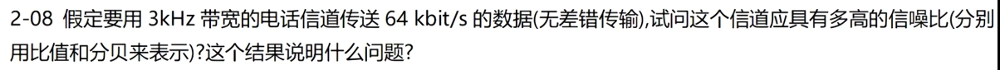
&nbsp;

&nbsp;

&nbsp;

&nbsp;

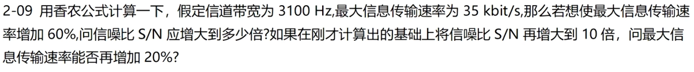
&nbsp;

&nbsp;

&nbsp;

&nbsp;

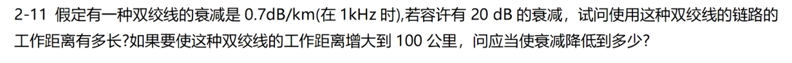
&nbsp;

&nbsp;

&nbsp;

&nbsp;

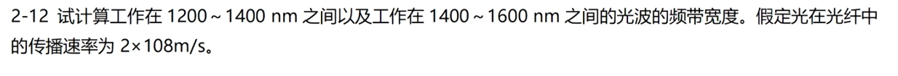
&nbsp;

&nbsp;

&nbsp;

&nbsp;

&nbsp;

&nbsp;

&nbsp;

&nbsp;

&nbsp;

&nbsp;

&nbsp;

&nbsp;

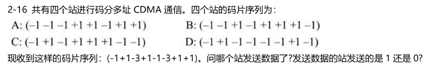
&nbsp;

&nbsp;

&nbsp;

&nbsp;

# 第 3 章 数据链路层

3-02，3-03，3-06，3-07，3-08，3-09，3-14，3-27

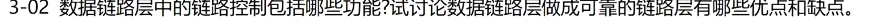
&nbsp;

&nbsp;

&nbsp;

&nbsp;

&nbsp;

&nbsp;

&nbsp;

&nbsp;

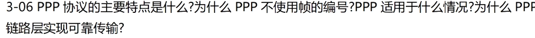
&nbsp;

&nbsp;

&nbsp;

&nbsp;

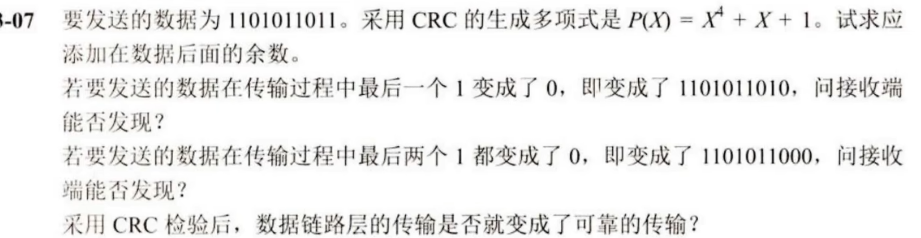
&nbsp;

&nbsp;

&nbsp;

&nbsp;

&nbsp;

&nbsp;

&nbsp;

&nbsp;

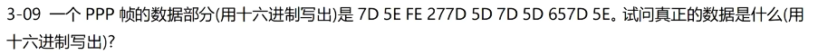
&nbsp;

&nbsp;

&nbsp;

&nbsp;

&nbsp;

&nbsp;

&nbsp;

&nbsp;

&nbsp;

&nbsp;

&nbsp;

&nbsp;

# 第 4 章 网络层

4-17，4-18，4-19，4-25，4-27，4-28，4-29，4-30，4-31，4-35，4-37，4-41，4-43

&nbsp;

&nbsp;

&nbsp;

&nbsp;

&nbsp;

&nbsp;

&nbsp;

&nbsp;

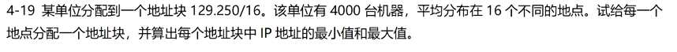
&nbsp;

&nbsp;

&nbsp;

&nbsp;

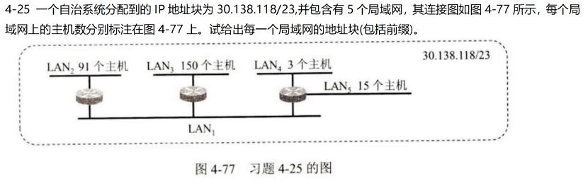
&nbsp;

&nbsp;

&nbsp;

&nbsp;

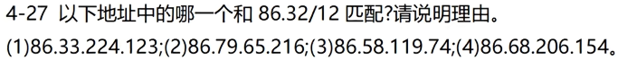
&nbsp;

&nbsp;

&nbsp;

&nbsp;

&nbsp;

&nbsp;

&nbsp;

&nbsp;

&nbsp;

&nbsp;

&nbsp;

&nbsp;

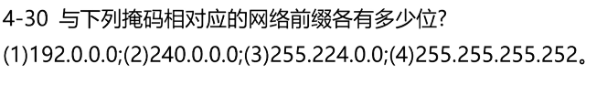
&nbsp;

&nbsp;

&nbsp;

&nbsp;

&nbsp;

&nbsp;

&nbsp;

&nbsp;

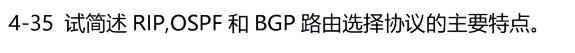
&nbsp;

&nbsp;

&nbsp;

&nbsp;

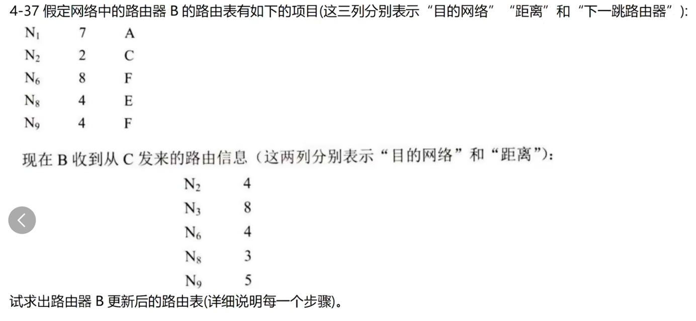
&nbsp;

&nbsp;

&nbsp;

&nbsp;

&nbsp;

&nbsp;

&nbsp;

&nbsp;

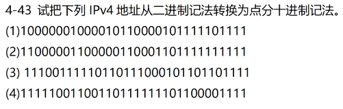
&nbsp;

&nbsp;

&nbsp;

&nbsp;

# 第 5 章 运输层

5-08、5-09，5-12，5-13，5-14，5-16，5-21，5-23

&nbsp;

&nbsp;

&nbsp;

&nbsp;

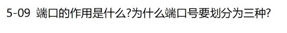
&nbsp;

&nbsp;

&nbsp;

&nbsp;

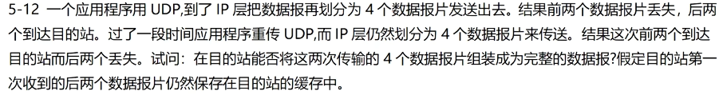
&nbsp;

&nbsp;

&nbsp;

&nbsp;

&nbsp;

&nbsp;

&nbsp;

&nbsp;

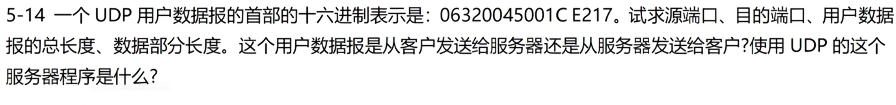
&nbsp;

&nbsp;

&nbsp;

&nbsp;

&nbsp;

&nbsp;

&nbsp;

&nbsp;

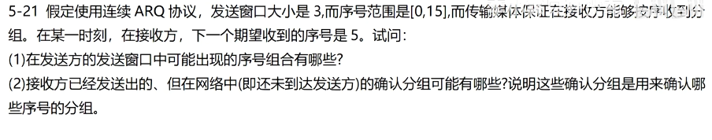
&nbsp;

&nbsp;

&nbsp;

&nbsp;

&nbsp;

&nbsp;

&nbsp;

&nbsp;

# 第 6 章 应用层
