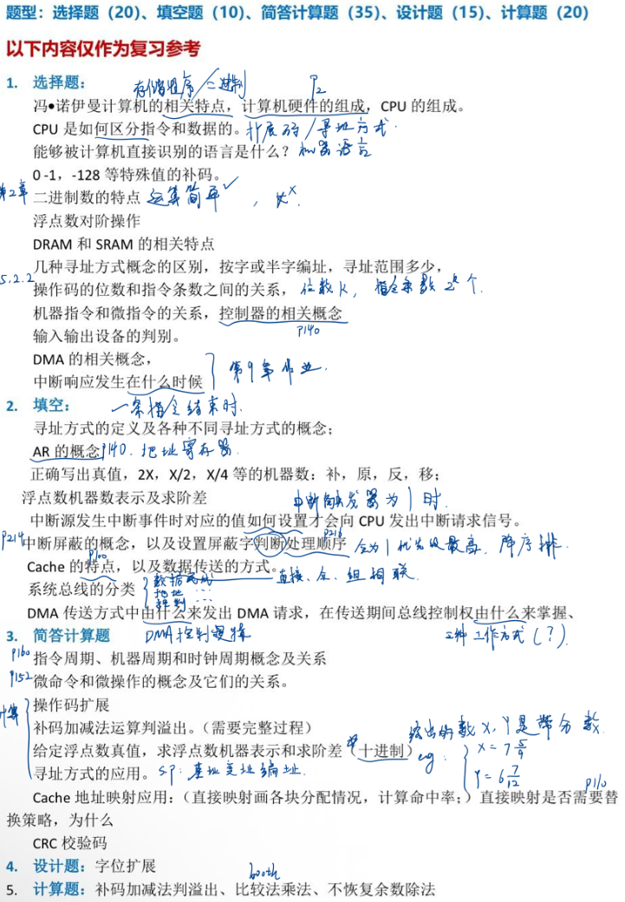

# 计算机组成原理

## 复习提纲2025秋 （黄老师学习通上发的）

### 1. 选择题：

冯·诺伊曼计算机的相关特点，计算机硬件的组成，CPU的组成。 \
CPU 是如何区分指令和数据的。 \
能够被计算机直接识别的语言是什么？ \
0-1，-128等特殊值的补码。 \
二进制数的特点 \
浮点数对阶操作 \
DRAM和SRAM 的相关特点 \
几种寻址方式概念的区别，按字或半字编址，寻址范围多少，\
操作码的位数和指令条数之间的关系， \
机器指令和微指令的关系，控制器的相关概念 \
输入输出设备的判别。 \
DMA的相关概念， \
中断响应发生在什么时候

### 2. 填空：

寻址方式的定义及各种不同寻址方式的概念; \
AR 的概念 \
正确写出真值，2X，X/2，X/4等的机器数:补，原，反，移: \
浮点数机器数表示及求阶差 \
中断源发生中断事件时对应的值如何设置才会向CPU发出中断请求信号。 \
中断屏蔽的概念，以及设置屏蔽字判断处理顺序 \
Cache的特点，以及数据传送的方式。 \
系统总线的分类 \
DMA传送方式中由什么来发出DMA请求，在传送期间总线控制权由什么来掌握

### 3. 简答计算题：

指令周期、机器周期和时钟周期概念及关系 \
微命令和微操作的概念及它们的关系。\
操作码扩展 \
补码加减法运算判溢出。(需要完整过程) \
给定浮点数真值，求浮点数机器表示和求阶差(十进制) \
寻址方式的应用。\
Cache地址映射应用:(直接映射画各块分配情况，计算命中率;)直接映射是否需要替换策略，为什么 \
CRC 校验码

### 4. 设计题：

字位扩展

### 5. 计算题:

补码加减法判溢出、比较法乘法、不恢复余数除法
