# 计算机网络

> 复习范围（以整理完答案）

# 选择题

1. 以下不属于 OSI 参考模型七层协议的是__。  
   A. 物理层  
   B. 传输层  
   **C. 网络接口层**  
   D. 表示层  

2. TCP 协议提供的是__服务。  
   A. 无连接、不可靠  
   **B. 面向连接、可靠**  
   C. 无连接、可靠  
   D. 面向连接、不可靠  

3. 下列 IP 地址中属于私网地址的是__。  
   **A. 192.168.1.1**  
   B. 202.103.22.68  
   C. 123.23.56.89  
   D. 172.33.45.78  

4. HTTP 协议工作在 OSI 参考模型的__。  
   A. 物理层  
   B. 网络层  
   **C. 应用层**  
   D. 传输层  

5. 用于将域名转换为 IP 地址的协议是__。  
   A. FTP  
   **B. DNS**  
   C. SMTP  
   D. Telnet  

6. 以下哪种设备工作在数据链路层__。  
   A. 路由器  
   B. 集线器  
   **C. 交换机**  
   D. 网关  

7. TCP/IP 协议簇中，负责路由选择的协议是__。  
   **A. IP**  
   B. TCP  
   C. UDP  
   D. ICMP  

8. 以太网采用的介质访问控制方法是__。  
   **A. CSMA/CD**  
   B. TDMA  
   C. FDMA  
   D. CDMA  

9. 下列不属于应用层协议的是__。  
   A. HTTP  
   **B. TCP**  
   C. FTP  
   D. SMTP  

10. 子网掩码 255.255.255.0 对应的子网前缀长度是__。  
    A. /16  
    **B. /24**  
    C. /32  
    D. /8  

11. IPv6 地址的长度是__位。  
    A. 32  
    B. 64  
    **C. 128**  
    D. 256  

12. 以下哪个不是 TCP 协议的标志位__。?  
    A. SYN  
    B. ACK  
    C. FIN  
    **D. URG**  

13. 网络层的主要功能是__。  
    A. 比特流传输  
    B. 帧的封装与传输  
    **C. 路由选择与转发**  
    D. 端到端可靠传输  

14. 集线器（Hub）工作在 OSI 参考模型的__。  
    **A. 物理层**  
    B. 数据链路层  
    C. 网络层  
    D. 应用层  

15. 下列属于面向连接的传输层协议是__。  
    A. UDP  
    **B. TCP**  
    C. IP  
    D. ICMP  

16. DNS 协议默认使用的端口号是__。  
    A. 21  
    B. 23  
    **C. 53**  
    D. 80  

17. 以太网帧的最小长度是__字节。  
    A. 46  
    **B. 64**  
    C. 1518  
    D. 1500  

18. 用于测试网络连通性的协议是__。  
    A. FTP  
    **B. Ping**  
    C. Telnet  
    D. HTTP  

19. 以下哪种拓扑结构的可靠性最高__。  
    A. 总线型  
    B. 星型  
    C. 环型  
    **D. 网状型**  

20. TCP 协议的流量控制机制是__。  
    **A. 滑动窗口**  
    B. 慢开始  
    C. 拥塞避免  
    D. 超时重传  

21. 私网地址 172.16.0.0 的子网掩码是__ ？  
    A. 255.0.0.0  
    **B. 255.255.0.0**  
    C. 255.255.255.0  
    D. 255.255.240.0  

22. 下列协议中属于网络层协议的是__。  
    A. HTTP  
    B. TCP  
    **C. IP**  
    D. ARP  

23. 交换机转发数据帧的依据是__。  
    A. IP 地址  
    **B. MAC 地址**  
    C. 端口号  
    D. 域名  

24. UDP 协议的特点是__。  
    A. 面向连接、可靠  
    **B. 无连接、不可靠**  
    C. 面向连接、不可靠  
    D. 无连接、可靠  

25. 以下哪个不是应用层协议__。  
    A. SMTP  
    B. FTP  
    **C. TCP**  
    D. Telnet  

26. 子网划分的目的是__。  
    A. 增加 IP 地址数量  
    **B. 减少广播域**  
    C. 提高网络速率  
    D. 简化路由配置  

27. 物理层的主要任务是实现__的传输。  
    **A. 比特流**  
    B. 帧  
    C. 数据包  
    D. 报文段  

28. 以下哪种设备可以连接不同网络协议的网络__。  
    A. 路由器  
    B. 交换机  
    **C. 网关**  
    D. 集线器  

29. HTTP 协议的默认端口号是__。  
    A. 21  
    B. 23  
    **C. 80**  
    D. 443  

30. TCP 四次挥手关闭连接时，第一次挥手发送的报文标志位是__。  
    A. SYN  
    B. ACK  
    **C. FIN**  
    D. RST  

# 填空题

1. 计算机网络的主要功能包括________、________ 和 ________。  

2. TCP/IP 参考模型分为________与________与________ 和应用层四层。  
3. 数据链路层的 PDU 称为________，网络层的 PDU 称为________。  
4. TCP 协议通过________ 和 ________ 机制实现拥塞控制。  
5. 常用的差错控制方法有________ 和 ________。  
6. 10BASE-T 以太网使用________ 作为传输介质，最大传输距离为________ 米。  
7. ARP 协议的作用是将________ 地址转换为________ 地址。  
8. 子网掩码 255.255.255.224 对应的子网前缀长度是________，每个子网最多支持________ 台主机。  
9. HTTPS 协议使用________ 端口进行通信，采用________ 协议进行加密。  
10. 典型交换技术包括报文交换、________ 和 ________ 三种交换。  
11. 网络协议三要素为________、________ 与 ________。  
12. Windows 系统在上网时转入 DOS 状态后，可使用________ 命令来测试主机的连通性，使用________ 命令来获得目的主机的路由信息，属于网络层中________ 协议的应用。  
13. 现在的网络协议体系结构，是综合 OSI 和 TCP/IP 的协议体系的优点，采用五层协议的体系结构，自上而下分别为________与________与________与________ 及物理层。  

> 《答案》  
    1. 数据通信、资源共享、分布式处理  
    2. 链路层（网络接口层）、网际层、传输层  
    3. 帧、IP数据报（或分组）  
    4. 慢开始、拥塞避免（或快重传、快恢复）  
    5. 前向纠错、自动重传请求  
    6. 双绞线、100  
    7. IP、MAC  
    8. /27、30  
    9. 443、SSL/TLS  
    10. 电路交换、分组交换  
    11. 语法、语义、同步  
    12. ping、tracert、ICMP  
    13. 应用层、传输层、网络层、数据链路层

# 简答题

### 1. 物理层的接口有哪几个方面的特性？各包含些什么内容？  

&nbsp;

&nbsp;

&nbsp;

机械特性；电气特性；功能特性；过程特性
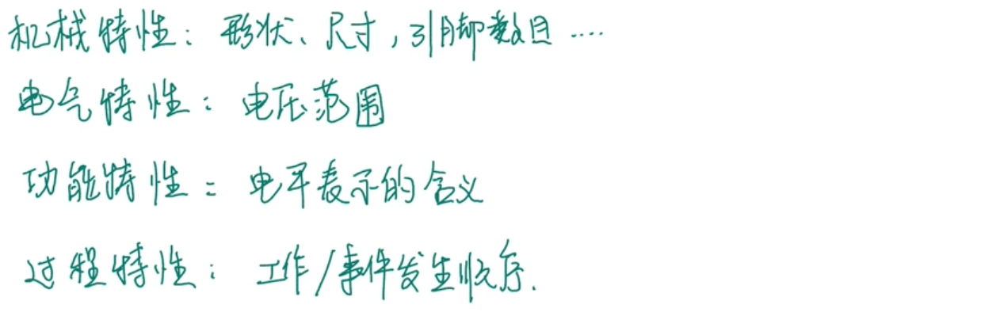

### 2. 请解释一下 CSMA/CD 协议的含义，并简单叙述一下它的工作原理。  

&nbsp;

&nbsp;

**“多点接入”**：总线型网络  
**“载波监听”**：边发送边监听
**“碰撞检测”**：发生冲突停传

&nbsp;

### 3. 为什么说 UDP 是面向报文的，而 TCP 是面向字节流的？  

&nbsp;

&nbsp;

&nbsp;

udp 和tcp 的特点
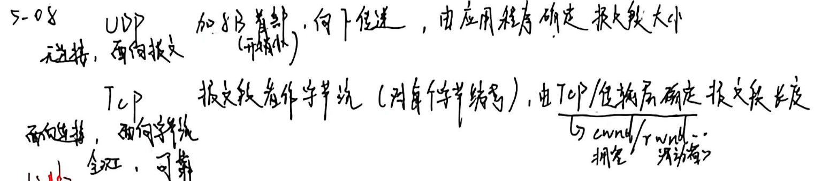

### 4. 数据链路层需要解决的三个基本问题是什么？并简单叙述一下每个基本问题的作用。  

&nbsp;

&nbsp;

&nbsp;

封装成帧；透明传输；差错检测（稍微论述一下）
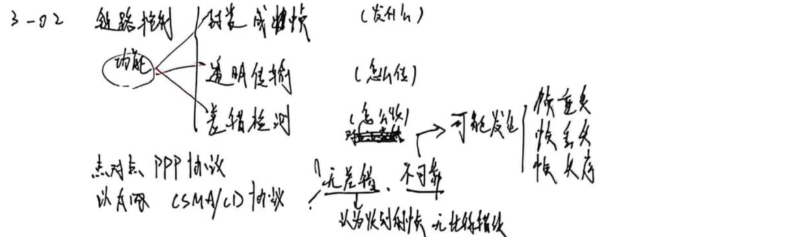

### 5. 试简单说明下列协议的作用：IP、ARP 和 ICMP。  

&nbsp;

&nbsp;

&nbsp;

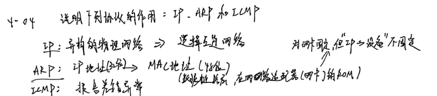

### 6. PPP 协议的主要特点是什么？为什么 PPP 不能使用帧的编号？PPP 适用于什么情况？  

&nbsp;

&nbsp;

&nbsp;

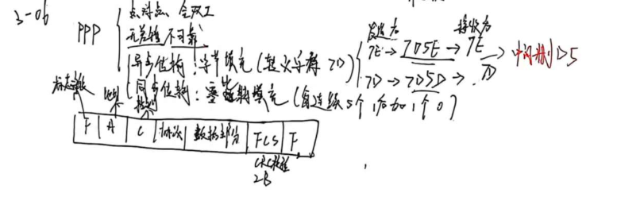
不能使用帧编号？ PPP设计用于点对点链路，不存在共享信道上的冲突问题，可保持协议简单高效。 
 
适用于什么情况？ 广泛应用于广域网点对点链路，例如家庭用户通过调制解调器拨号上网

# 计算题部分

> 可对照下一章（学习通布置习题），我手写答案都放上去了

## 1. 香农公式类  

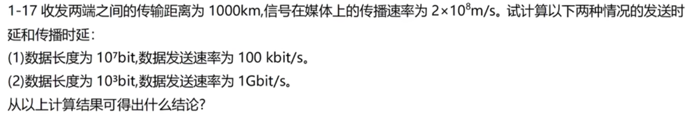

&nbsp;

&nbsp;

&nbsp;

&nbsp;

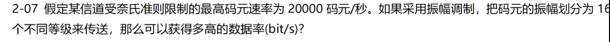

&nbsp;

&nbsp;

&nbsp;

&nbsp;

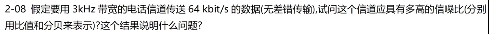

&nbsp;

&nbsp;

&nbsp;

&nbsp;

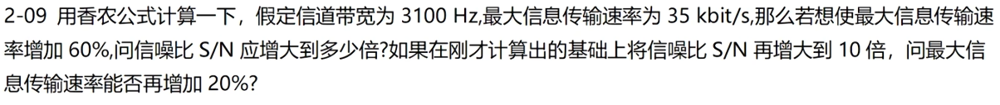

&nbsp;

&nbsp;

&nbsp;

&nbsp;

## 2. CDMA 通信  

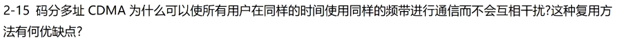

&nbsp;

&nbsp;

&nbsp;

&nbsp;

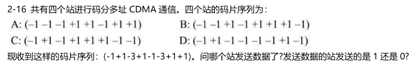

&nbsp;

&nbsp;

&nbsp;

&nbsp;

## 3. CRC 校验计算  

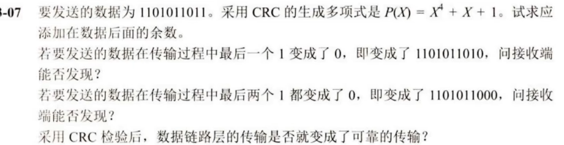

&nbsp;

&nbsp;

&nbsp;

&nbsp;

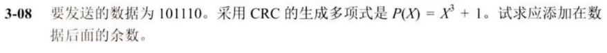

&nbsp;

&nbsp;

&nbsp;

&nbsp;

## 4. 路由表更新  

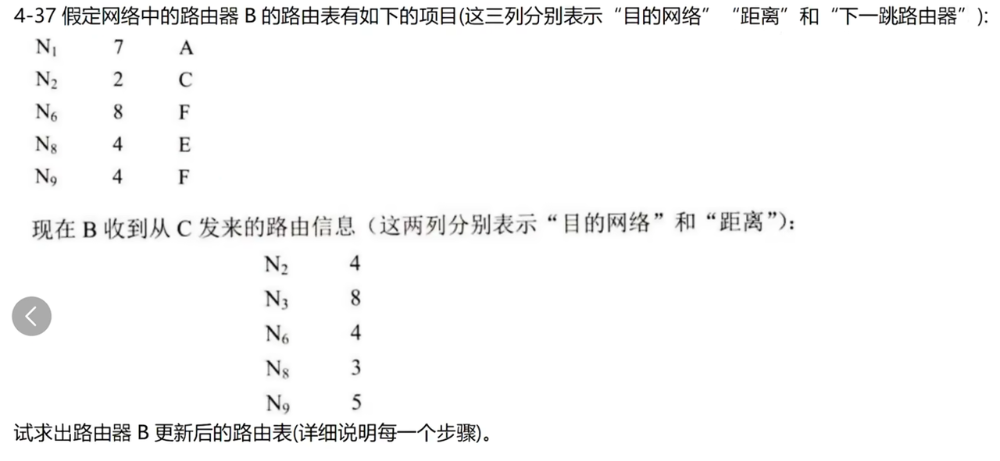

&nbsp;

&nbsp;

&nbsp;

&nbsp;

## 5. TCP 报文  

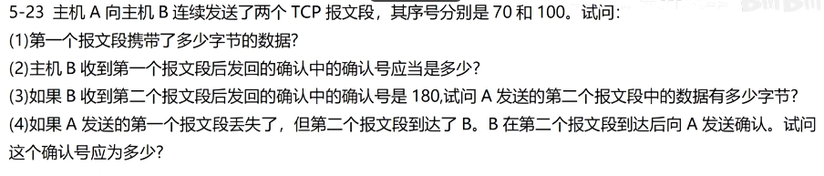

&nbsp;

&nbsp;

&nbsp;

&nbsp;

## 6. 地址块分配，地址范围  

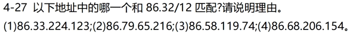

&nbsp;

&nbsp;

&nbsp;

&nbsp;

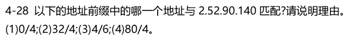

&nbsp;

&nbsp;

&nbsp;

&nbsp;

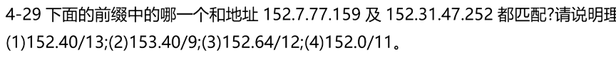

&nbsp;

&nbsp;

&nbsp;

&nbsp;

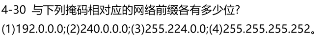

&nbsp;

&nbsp;

&nbsp;

&nbsp;

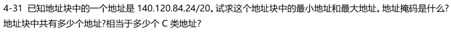

&nbsp;

&nbsp;

&nbsp;

&nbsp;

## 7. 子网主机数  

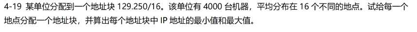

&nbsp;

&nbsp;

&nbsp;

&nbsp;

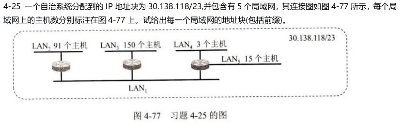
