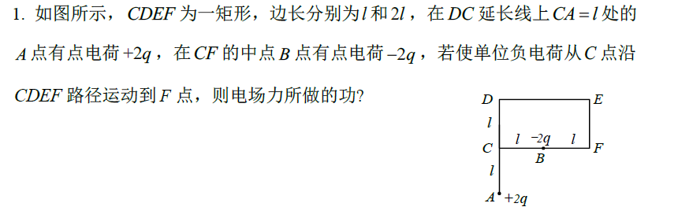
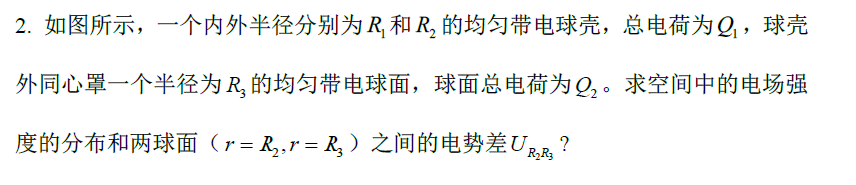

# 大学物理B

## 2025-2026 秋季学期 大学物理B 期末考试复习说明

## 一、题型
选择题（17 道题 52 分，其中一题 4 分，其它的每题 3 分）\

判断题（3 分 * 3 = 9 分） \

填空题（3 分 * 3 = 9 分）\

计算题（10 分 * 3 = 30 分）

## 二、各章分数比例
第5 章 静电场40%左右\
第7 章 恒定磁场35%左右\
第8 章 电磁感应25%左右

# 三、期末考试提醒
所有题目的答案必须写在答题卡上，写在试卷上无效。其中选择题和判断题答案需用2B铅笔涂在答题卡上对应位置，填空题和解答题的答案统一写在答题卡上对应位置。\
可以**携带无存储功能的计算器**

# 四、各章知识点：
> 具体看pdf

# 五、练习题

&nbsp;

&nbsp;

&nbsp;

&nbsp;

&nbsp;

&nbsp;

&nbsp;

&nbsp;

&nbsp;

&nbsp;

&nbsp;

&nbsp;

&nbsp;

&nbsp;

&nbsp;

&nbsp;

